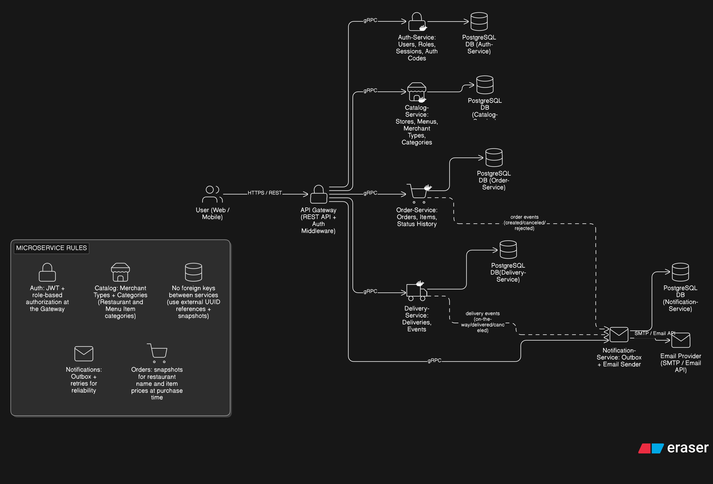
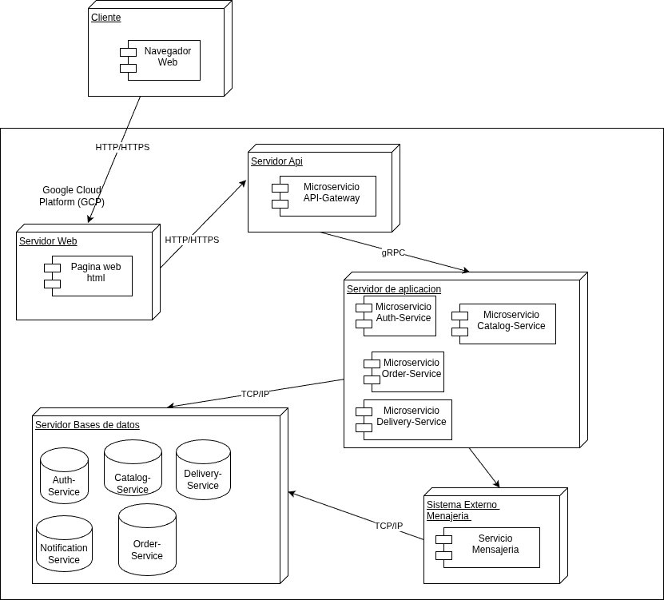
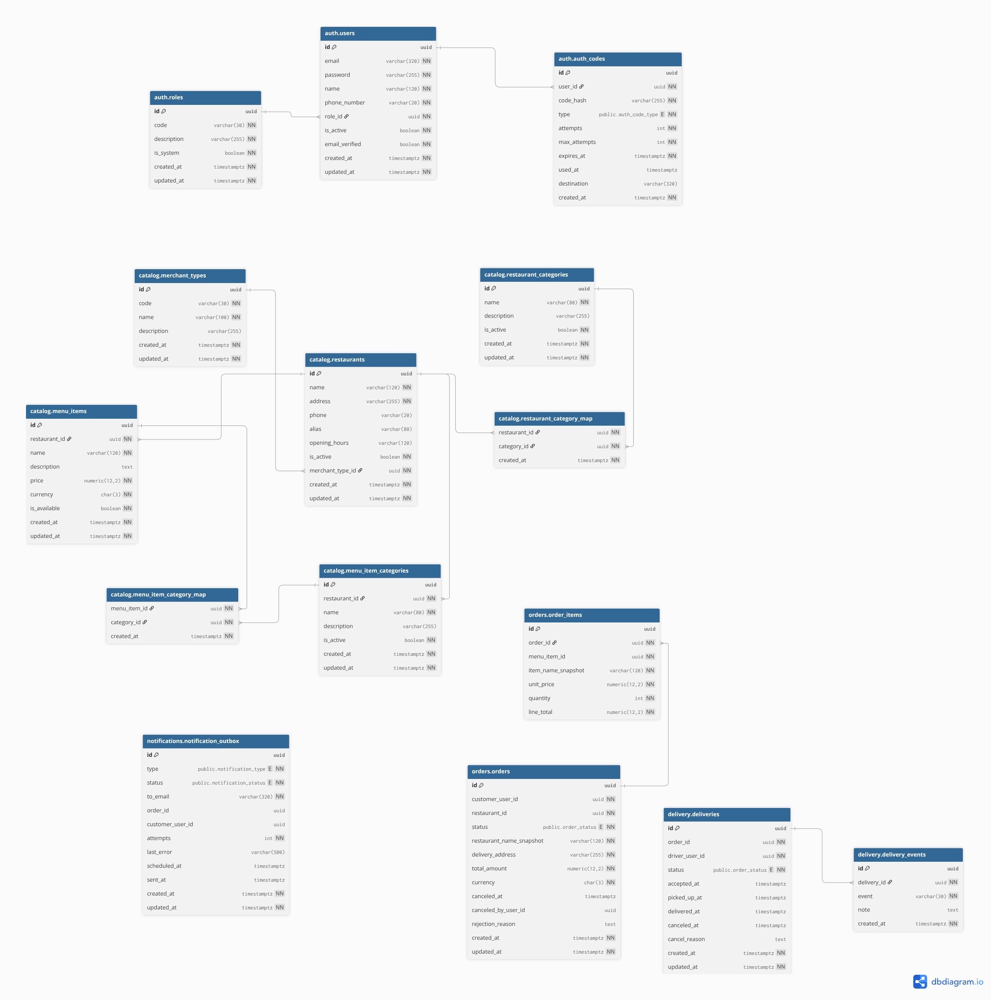

# Documentación

## Requerimientos funcionales

### RF-01 Gestión de usuarios y autenticación (Auth-Service)

* **RF-01.1** Registrar usuarios con correo electrónico, contraseña y rol.
* **RF-01.2** Validar que el correo electrónico sea único al registrarse.
* **RF-01.3** Almacenar contraseñas de forma segura mediante funciones de hash.
* **RF-01.4** Iniciar sesión con correo electrónico y contraseña.
* **RF-01.5** Generar un token de autenticación (JWT) cuando las credenciales sean correctas.
* **RF-01.6** Validar el token de autenticación para autorizar solicitudes protegidas.
* **RF-01.7** Administrar roles como una entidad configurable (crear, consultar, actualizar y desactivar roles) con acceso exclusivo para administradores.
* **RF-01.8** Permitir asignar o cambiar el rol de un usuario con acceso exclusivo para administradores.

#### Recuperación de contraseña (Olvidé mi contraseña / Restablecer contraseña)

* **RF-01.9** Permitir solicitar recuperación de contraseña ingresando el correo electrónico.
* **RF-01.10** Si el correo existe, generar un código de restablecimiento de un solo uso, con expiración y límite de intentos, almacenándolo de forma segura.
* **RF-01.11** Enviar al correo electrónico instrucciones para restablecer la contraseña.
* **RF-01.12** Responder con un mensaje genérico para no revelar si el correo está registrado.
* **RF-01.13** Validar el código verificando que no esté expirado, que no haya sido usado y que no exceda el límite de intentos.
* **RF-01.14** Permitir establecer una nueva contraseña con un código válido y actualizar las credenciales de acceso.

---

### RF-02 API Gateway (punto de entrada)

* **RF-02.1** Exponer endpoints REST para el frontend.
* **RF-02.2** Validar el token de autenticación en las solicitudes entrantes.
* **RF-02.3** Autorizar el acceso por rol según el endpoint solicitado.
* **RF-02.4** Enrutar y orquestar llamadas hacia microservicios internos mediante gRPC.

---

### RF-03 Catálogo de restaurantes y tiendas (Catalog-Service)

#### Gestión de tipos de comercio

* **RF-03.1** Permitir administrar tipos de comercio (por ejemplo: restaurante, supermercado, farmacia) con acceso exclusivo para administradores.
* **RF-03.2** Asignar un tipo de comercio a cada restaurante o tienda.

#### Gestión de restaurantes/tiendas

* **RF-03.3** Permitir a administradores crear, consultar, actualizar y eliminar restaurantes/tiendas.
* **RF-03.4** Permitir a los clientes listar restaurantes/tiendas disponibles.
* **RF-03.5** Permitir a los clientes filtrar restaurantes/tiendas por tipo de comercio.

#### Categorías de restaurantes (etiquetas)

* **RF-03.7** Permitir gestionar categorías de restaurantes (crear, consultar, actualizar y desactivar) según la política definida (administrador y/o comerciante).
* **RF-03.8** Permitir asignar o desasignar categorías a un restaurante/tienda.
* **RF-03.9** Permitir al cliente filtrar restaurantes por categoría.

#### Menú y productos

* **RF-03.10** Permitir a comerciantes crear, consultar, actualizar y eliminar productos del menú.
* **RF-03.11** Permitir a los clientes visualizar el menú de un restaurante/tienda.
* **RF-03.12** Permitir a comerciantes activar o desactivar la disponibilidad de productos del menú.

#### Categorías de productos/menú

* **RF-03.13** Permitir a comerciante gestionar categorías de productos/menú por restaurante/tienda (crear, consultar, actualizar y desactivar).
* **RF-03.14** Permitir a comerciante asignar o desasignar categorías a productos del menú.
* **RF-03.15** Permitir a cliente filtrar o visualizar productos del menú por categoría dentro de un restaurante/tienda.

---

### RF-04 Gestión de órdenes (Order-Service)

* **RF-04.1** Permitir a los clientes crear una orden a partir de un carrito y enviarla al restaurante/tienda.
* **RF-04.2** Conservar la información de compra (por ejemplo: nombres y precios al momento de comprar) para mantener consistencia histórica.
* **RF-04.3** Permitir a los clientes cancelar una orden según reglas del negocio.
* **RF-04.4** Permitir a comerciantes consultar órdenes recibidas.
* **RF-04.5** Permitir a comerciantes aceptar una orden y actualizar su estado.
* **RF-04.6** Permitir a comerciantes marcar una orden como lista para entrega.
* **RF-04.7** Permitir a comerciantes rechazar una orden indicando una razón.
* **RF-04.8** Registrar el historial de cambios de estado de la orden.

---

### RF-05 Gestión de entregas (Delivery-Service)

* **RF-05.1** Permitir a repartidores consultar órdenes disponibles para entrega cuando estén listas.
* **RF-05.2** Permitir a repartidores aceptar una entrega y actualizar su estado.
* **RF-05.3** Permitir a repartidores marcar una entrega como entregada.
* **RF-05.4** Permitir a repartidores cancelar una entrega indicando una razón.
* **RF-05.5** Registrar eventos relevantes del proceso de entrega.

---

### RF-06 Notificaciones por correo electrónico (Notification-Service)

* **RF-06.1** Enviar un correo al cliente cuando se cree una orden.
* **RF-06.2** Enviar un correo al cliente cuando el cliente cancele una orden.
* **RF-06.3** Enviar un correo al cliente cuando la orden sea asignada a un repartidor o esté en camino.
* **RF-06.4** Enviar un correo al cliente cuando la orden sea cancelada por el restaurante o el repartidor, incluyendo responsable y motivo.
* **RF-06.5** Enviar un correo al cliente cuando la orden sea rechazada.
* **RF-06.6** Registrar las notificaciones para permitir reintentos en caso de fallo.

---

## Requerimientos no funcionales

### RNF-01 Arquitectura y comunicación

* **RNF-01.1** Implementar una arquitectura basada en microservicios.
* **RNF-01.2** Implementar un API Gateway como punto de entrada único.
* **RNF-01.3** Usar REST para consumo externo (frontend → gateway).
* **RNF-01.4** Usar gRPC para comunicación interna (gateway → microservicios).

### RNF-02 Seguridad

* **RNF-02.1** Autenticación basada en tokens (JWT).
* **RNF-02.2** Autorización basada en roles para restringir funcionalidades según el tipo de usuario.
* **RNF-02.3** Almacenamiento seguro de contraseñas mediante hash; nunca almacenar contraseñas en texto plano.
* **RNF-02.4** Los códigos de autenticación deben almacenarse de forma segura, con expiración y límite de intentos.
* **RNF-02.5** En recuperación de contraseña, el sistema debe responder con mensajes genéricos para evitar enumeración de usuarios.

### RNF-03 Persistencia y consistencia

* **RNF-03.1** Persistencia obligatoria .
* **RNF-03.2** Cada microservicio debe administrar su propia base de datos o esquema, evitando dependencias directas con bases de datos de otros servicios.
* **RNF-03.3** Las órdenes deben conservar información histórica de compra para mantener consistencia en el tiempo.

### RNF-04 Despliegue e infraestructura

* **RNF-04.1** Contenerización con Docker para cada microservicio.
* **RNF-04.2** Orquestación local con Docker Compose.
* **RNF-04.3** Despliegue en la nube (GCP).
* **RNF-04.4** Configuración reproducible mediante variables de entorno.

### RNF-05 Calidad, mantenibilidad y experiencia de usuario

* **RNF-05.1** Interfaz (UI/UX) amigable para navegación, incluyendo filtros por tipo de comercio y categorías.
* **RNF-05.2** Manejo consistente de errores (códigos HTTP adecuados y mensajes claros desde el gateway).
* **RNF-05.3** Registro de logs por servicio para diagnóstico y soporte.

### RNF-06 Escalabilidad y rendimiento

* **RNF-06.1** El sistema debe minimizar dependencias entre microservicios para evitar cuellos de botella (por ejemplo, evitando consultas directas entre bases de datos y usando referencias por ID y “snapshots” cuando sea necesario).
* **RNF-06.2** Cada microservicio debe poder escalar su persistencia de manera independiente (base de datos/esquema por servicio), sin requerir cambios en otros servicios.

## Diagrama de Arquitectura de Alto nivel

## Diagrama de Deslpiegue

## Diagrama Entidad Relacion (ER)

## Database

**BMS**: Postgres
